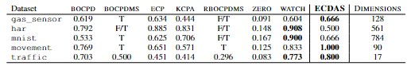

# ECDAS: Online and Explainable Change Detection in High-Dimensional Data Streams

> **Abstract:** Online and explainable change detection in high-dimensional data stream is a challenging problem. It has various applications, including predictive maintenance in complex IoT systems and preventive anomaly detection. Most recent works focus on detecting a change in time series without taking into account industrial contexts such as data heterogeneity and real-time data mining applications. Furthermore, the majority of existing methods lack interpretability to explain the model output and local changes in input variable space. Such information could speed up the adoption of automated decision-making models by organizations where explainable models are preferred. To address such needs, we propose ECDAS, a change detection model that combines sliding windows and distribution drift, to provide an explainable method that performs two learning tasks: change scoring and detection in an online fashion with only one pass on the data streams. Our model guarantees the following key properties: (1) change detection in constant space and constant time (per incoming instance), (2) effective in high-dimensional data, (3) online learning, one-pass and un-supervised. Furthermore, an extensive evaluation using a recent TCPD benchmark and real-world datasets demonstrated that our ECDAS outperforms current state-of-the-art methods on five high-dimensional datasets.

## Usage

`ChangeGraph` in [change_graph.py](https://github.com/MariamBARRY/streaming_change_detection/blob/main/change_graph.py) as follows

```py
ChangeGraph(['feature_1', 'feature_2', ...], window_size=100, scaler=StandardScaler)
```

Feature values can be scaled in an online fashion using `StandardScaler`or `MinMaxScaler` in [feature/scaler.py](https://github.com/MariamBARRY/streaming_change_detection/blob/main/feature/scaler.py).

## Experiments

Experiments can be run on randomly generated datasets as demonstrated in [test.ipynb](https://github.com/MariamBARRY/streaming_change_detection/blob/main/test.ipynb).

Experiments on the [TCPD benchmark](https://github.com/alan-turing-institute/TCPDBench) have shown that ECDAS outperforms current state-of-the-art methods on five high-dimensional datasets.

<section align='center'>
    <span><b>Metric:</b> F1 score</span>
    
</section>

<section align='center'>
    <span><b>Metric:</b> Cover</span>
    
</section>
